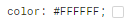
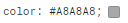
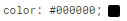
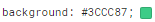
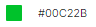

# Figma - Criando formulário com validação.

## Bem vindo! 👋

Obrigado por conferir meu projeto que é um  desafio de codificação do site: [figma.com](https://www.figma.com/file/zBKnYG9UNdUiIr8ClQTWSG/DESAFIO---HTML%2FCSS%2FJS-INTERMEDI%C3%81RIO?node-id=3-2&t=BQo1AAKzdEPNmxW8-0).

Podemos visualizar o projeto "Formulário" das seguintes maneiras:
## Validação do formulário:
- Para ser validado o formulário, todos os seus campos devem estar preechidos e assim irá ficar com as bordas verde;

## Formulário não validado:
- Como podemos visualizar que ao tentar enviar o formulário, veremos alguns campos que não foram preenchidos, então será retornado uma mensagem de alerta para os campos não preenchidos.

## Índice

- [Meu processo](#meu-processo)
  - O projeto foi construído seguindo todos os passos do desafio do figma, para a criação de um formulário, usando HTML, CSS3 e JavaScript puro.
  Ao clicar para enviar o formulário, se caso algum campo não estiver preenchido, a borda do input deve ficar vermelha e uma mensagem de "campo obrigatório" deve aparecer embaixo do campo que não foi preenchido, conforme o figma.
  O fundo do formulário deve ser feito usando a imagem anexada ao projeto. E assim colocando em prática os conhecimentos adquiridos durante as aulas no "Dev Quest". 

## Estilo do projeto

### Layout
  - O projeto foi criado para versão "Desktop".

### Cores
  -  ;
  -  ;
  -  ;
  -  ;
  -  ;
  -  ;
  
## Tipográfia

### Título e Corpo
- Family: [Roboto](https://fonts.google.com/specimen/Roboto)
- Weights: 400, 700 e 900

## Meu processo

### Criando com
- Marcação HTML5;
- Estilizando com CSS3;
- JavaScript;

### O que aprendi
A trabalhar com JavaScript, para trazer comandos ao "Formulário", foi bem desafiador o projeto na parte do JavaScript, houveram muitas dúvidas, de como criar uma função para validar e criar uma mensagem de alerta no caso de campos não preenchidos no formulário, fiz muitas consultas em minhas anotações de estudo e pesquisa na comunidade Discord "Dev Quest" no canal duvidas-javascript. Lá consegui encontrar dúvidas parecidas com a minha e obter resultado que eu procurava para finalizar o projeto.

### Desenvolvimento contínuo

Continuar a treinar em projetos o HTML, CSS e JavaScript para cada vez mais adquirir experiência. Sendo essencial continuar a praticar para ganhar cada vez mais conhecimentos e habilidades.  

## Author

- GitHub-pages - [Formulário com validação](https://deborafsilva.github.io/****)
- Linkedin - [Debora Fernandes da Silva | www.linkedin.com/in/deborafernandesdasilva](www.linkedin.com/in/deborafernandesdasilva)

